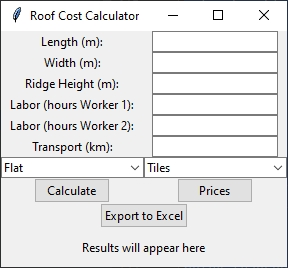

# 🏠 Roof Cost Calculator by Hexagon Lab

[](https://www.python.org/)
[](https://docs.python.org/3/library/tkinter.html)
[](https://opensource.org/licenses/MIT)

A user-friendly desktop application for estimating roofing costs based on roof dimensions, material type, labor, and transportation. Built with **Python**, **Tkinter**, and **Pandas**, this calculator helps generate quick cost breakdowns and export them to Excel.

---

## 📸 Screenshot

> Add your own screenshot to the `screenshots/` folder and update the path below.

<p align="center">
  
</p>

---

## ✨ Features

✅ Calculates roof surface area based on type (Flat, Gable, Hip)  
✅ Estimates number of material units needed  
✅ Calculates costs: materials, beams, two workers' labor, transport  
✅ Allows updating material prices via dialog  
✅ Exports cost breakdown to Excel (`report.xlsx`)  
✅ Simple and intuitive GUI with dropdowns and inputs

---

## ⚙️ Installation

1. **Clone the repository**:

```bash
git clone https://github.com/KallPetrov/Roof-Cost-Calculator.git
cd roof-cost-calculator
